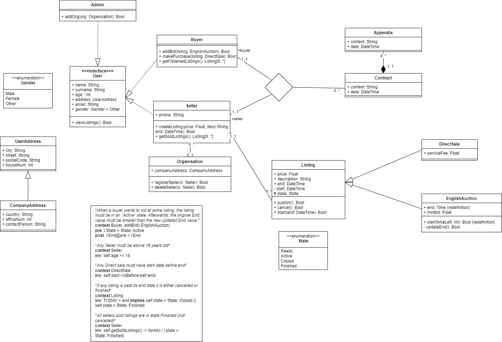

# UML 
UML describes a structure of an auction system for professional clients (that is currently in the analysis phase of a real world project). The auction system has a very simple system of users divided to `Buyers` and `Sellers`. There is also `Admin` user which is responsible for maintenance. Sellers can be grouped in organisations, but buyers are individual entities.

Listings at the auctions are of two types - `Direct Sale` which is a fixed price product for sale and `English Auction` which works on a system of bids with deadline which gets incremented after every bid.

Contracts might be made of appendices and declare the terms of contract between the buyer and the seller. 

# OCL
*When a buyer wants to bid at some listing, the listing must be in an `Active` state. Afterwards, the original End value must be smaller than the new updated End value.*
context Buyer::addBid(l:EnglishAuction)

**pre**: l.State = State::Active

**post**: l.End@pre < l.End

---

*Any Seller must be above 18 years old.*

**context** Seller

**inv**: self.age >= 18

---

*Any Direct sale must have start date before end.*

**context** DirectSale

**inv**: self.start->isBefore(self.end)

---

*If any listing is past its end date it is either cancelled or finished.* (existance of TODAY date is assumed)

**context** Listing

**inv**: TODAY > end **implies** self.state = State::Closed || self.state = State::Finished

---

*All sellers sold listings are in state Finished (not cancelled).*

**context** Seller

**inv**: self.getSoldListings() -> forAll(l | l.state = State::Finished)